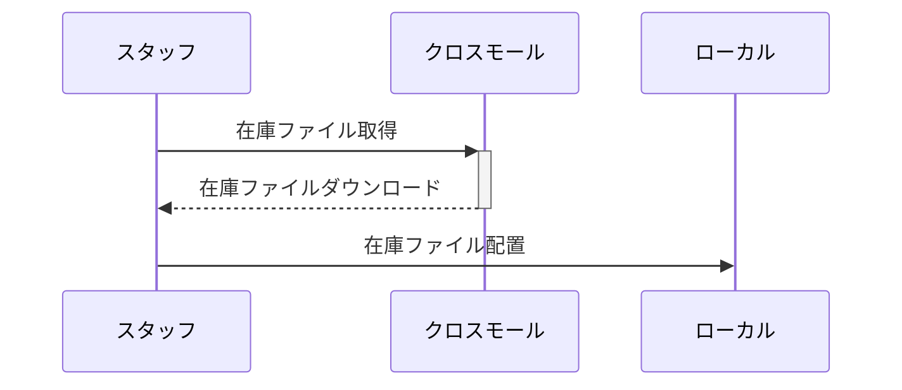

# 在庫スクレーピングPJT

## 概要
ウェブサイトで在庫数を確認し、クロスモールで在庫数を入れるオペレーションを自動化する。


## 要件定義
### 業務要件
| 内容                                                         |
| :----------------------------------------------------------- |
| 毎日決まった時間に自動的にワンワールドなどのウェブサイトから在庫数を取得し、それをクロスモールに反映することができる |
| 初回は対応ブランドはワンワールドのみ                         |


###  システム要件

| 内容                                                         |
| ------------------------------------------------------------ |
| 初回はワンワールドに対応するが、様々なブランドになるべく少ない改修範囲で対応できるつくりにする |
| 出品商品が増えても改修が不要なように、各ブランドサイトの商品名でクロスモールの管理番号を検索、割り当てることができるようにする |


### 機能要求

| 内容                                                         |
| ------------------------------------------------------------ |
| 各ブランドサイトから在庫数と商品名を取得できる               |
| クロスモールから最新の商品管理番号と商品名を取得できるようにする |
|                                                              |


### システムフロー

#### 対象ブランド商品が追加出品された時




#### 日次バッチ

```mermaid
sequenceDiagram
クーロン->>rubyファイル: 実行
rubyファイル->>+ブランドサイト: 商品名と在庫数要求
ブランドサイト-->>rubyファイル: 商品名と在庫数一覧
rubyファイル->>-ブランドサイトテーブル: 商品名と在庫数保存
rubyファイル->>+ローカル: クロスモール在庫ファイル要求
ローカル-->>rubyファイル: クロスモール在庫ファイル在庫ファイル
rubyファイル->>rubyファイル: 在庫ファイル整形
rubyファイル->>-クロスモールテーブル: クロスモール在庫商品名・商品管理番号登録
loop ブランドサイトテーブルのレコード数
rubyファイル->>+ブランドサイトテーブル: 商品名要求
ブランドサイトテーブル->>rubyファイル: 商品名
rubyファイル->>-クロスモールテーブル: 商品名検索・商品管理番号紐付け
end
クロスモールテーブル-->>+rubyファイル: 商品管理番号と在庫一覧
rubyファイル->>-ローカル: 商品管理番号と在庫一覧CSV出力
クーロン->>+ローカル: 商品管理番号と在庫一覧CSVアップロード要求
Note right of クロスモール: 在庫ファイルアップロードはshould
ローカル->>-クロスモール: 在庫ファイルアップロード
rubyファイル->>スタッフ:  完了・エラーメール送信
```


## 